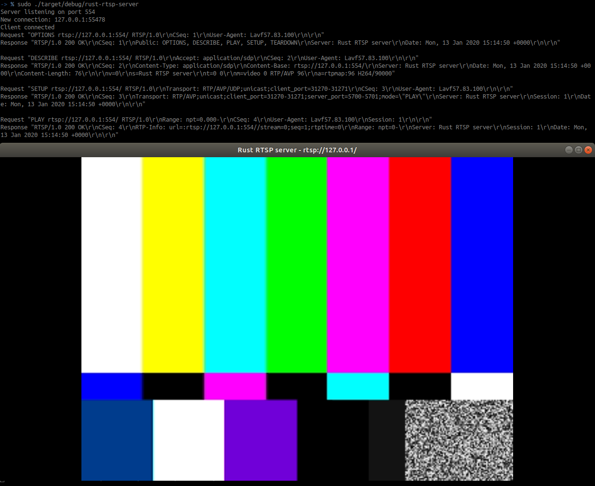

#### Rust Rtsp Server 

A simple RTSP server implementation using rust to parse & respond to requests.  
Then GStreamer to serve the video for the negotiated session. 

#### Sample server output & session streamed using ffplay



#### Docker  

Build  
```shell script
docker build -t rust_rtsp .
```

Run built image
```shell script
docker run --rm -d --network host rust_rtsp                                         
``` 

Build & run in Docker while developing on local host
```shell script
docker build -t rust_rtsp .
docker run -it --rm -d -v $(pwd):/src --network host rust_rtsp /bin/bash
cd /src
cargo build
RUST_BACKTRACE=1 ./target/debug/rust-rtsp-server
```                   

#### Connecting with a client
If you have installed the packages listed in the dockerfile on Ubuntu, 
you can run the following command to launch a test client 
and see the results in the image above:
```shell script
ffplay rtsp://127.0.0.1:5554
```            
